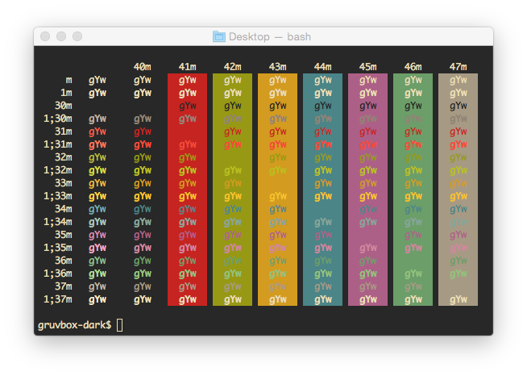
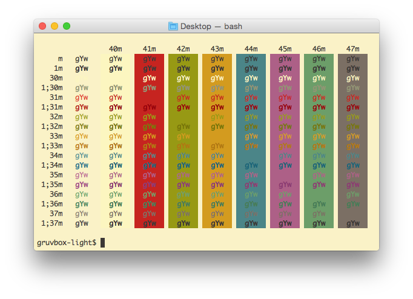

# Gruvbox Mac Terminal Theme

Port from [morhetz/gruvbox](https://github.com/morhetz/gruvbox).

## Dark


## Light


### Tip
Add the following to your `.profile`, `.bashrc`, or `.bash_profile` to enable `ls` coloring.

``` shell
export CLICOLOR=1
```
